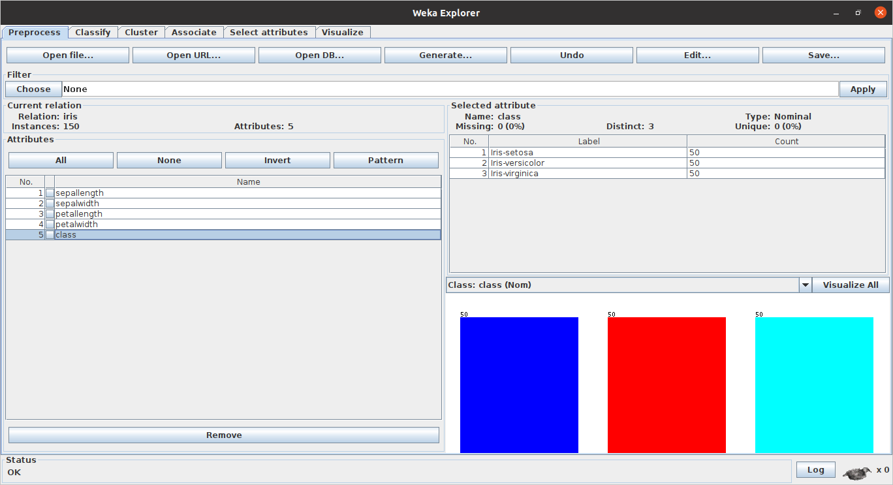
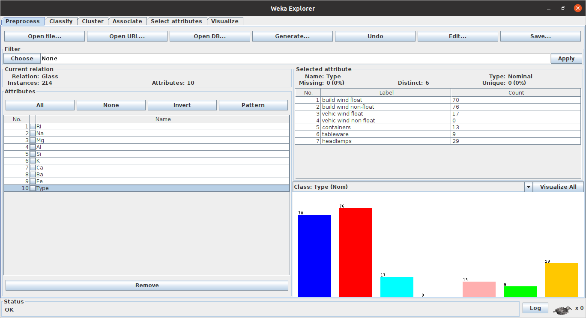
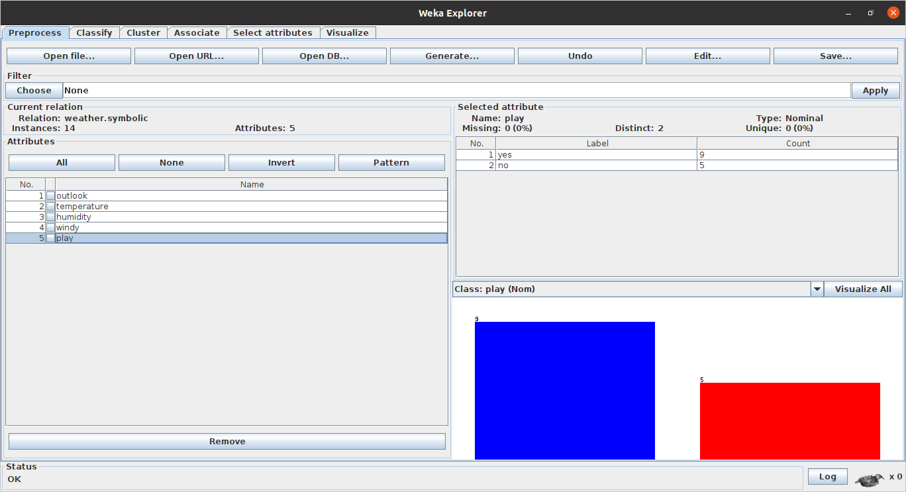

# Weka Demo

## What is Weka ?
### What is Weka Explorer ?
### What is Weka Experimenter ?

## Comparaison de différents classifieurs pour plusieurs jeux de données

### Présentation globale des jeux de données utilisés

* **Iris dataset** :

Le jeux de données *Iris* contient la description de 150 spécimens d'iris. Chaque description est composée de 4 attributs (la largeur et la longueur de leurs pétals et sépals) et la classe de l'instance (i.e. la
sorte d’iris à laquelle elle appartient : Iris-setosa, Iris-versicolor et Iris-virginica). 

➡️  Tous les attributs de ce jeux de données sont numériques.

➡️  Chacune des 3 classes contient 1/3 des instances.

* **Glass dataset** : 

Le jeux de données *Glass* contient la description de 214 instances de verre. L'étude de la classification des types de verre a été motivée par une enquête criminologique. Sur les lieux du crime, le verre laissé peut servir de preuve... s'il est correctement identifié !

Chaque instance est décrite par 9 attributs numériques continues et peut appartenir à l'une des 7 classes ('build wind float', 'build wind non-float', 'vehic wind float' , 'vehic wind non-float', 'containers', 'tableware', 'headlamps'). 

-> 'build wind float' et 'build wind non-float' sont les classes majoritaires.

* **Weather dataset** : 

Le jeux de données *Weather* contient 14 instances. Chacune décrite par 4 attributs ('outlook', 'temperature', 'humidity', 'windy') et appartient à une des deux classes (play or not).

