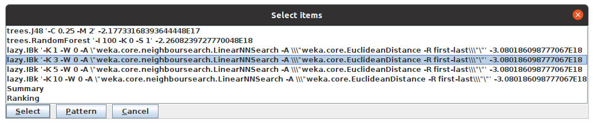
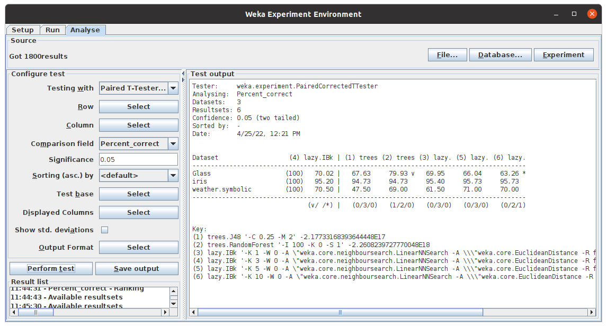

# Weka Demo

On va utiliser Weka Explorer et Weka Experimenter pour analyser qq jeux de données et comparer les performances des différents classifieurs sur chacun des jeux de données.

## Présentation globale des jeux de données utilisés

* **Iris dataset** :

Le jeux de données *Iris* contient la description de 150 spécimens d'iris. Chaque description est composée de 4 attributs (la largeur et la longueur de leurs pétals et sépals) et la classe de l'instance (i.e. la
sorte d’iris à laquelle elle appartient : Iris-setosa, Iris-versicolor et Iris-virginica). 

➡️  Tous les attributs de ce jeux de données sont numériques.

➡️  Chacune des 3 classes contient 1/3 des instances.

* **Glass dataset** : 

Le jeux de données *Glass* contient la description de 214 instances de verre. L'étude de la classification des types de verre a été motivée par une enquête criminologique. Sur les lieux du crime, le verre laissé peut servir de preuve... s'il est correctement identifié !

Chaque instance est décrite par 9 attributs numériques continues et peut appartenir à l'une des 7 classes ('build wind float', 'build wind non-float', 'vehic wind float' , 'vehic wind non-float', 'containers', 'tableware', 'headlamps'). 

➡️ 'build wind float' et 'build wind non-float' sont les classes majoritaires.

* **Weather dataset** : 

Le jeux de données *Weather* contient 14 instances. Chacune décrite par 4 attributs ('outlook', 'temperature', 'humidity', 'windy') et appartient à une des deux classes (play or not).

## Classifieurs utilisés

* **Random Forest**
* **J48**
* **IBk** with 

## Weka Setup

On va tester les classifieurs avec une validation croisée de 10 folds. Afin d'obtenir des résultats statistiquement significatifs, on va répeter l'exécution de chaque algorithme 10 fois ➡️ On aura 100 appels de chaque classificateur avec des données d'apprentissage et testés par rapport aux données de test.

On a préféré d'itérer d'abord sur les algorithmes que sur les jeux de données i.e. on va tester chaque algorithme sur tous les jeux de données avant de passer au algorithme suivant ➡️ De cette façon, on va compléter les résultats de tous les jeux de données pour un algorithme le plus tôt possible.

On a spécifié un fichier CSV ('experiment.csv') comme destination des résultats de l'exécution de l'expérience.

On a utilisé des chemins relatifs pour l'ajout de jeux de données dans le but de faciliter l'exécution de la même expérience sur différentes machines.

## Analyse des résultats 

On exécute l'expérience :

Et on analyse les résultats à l'aide du ficihier CSV ou du l'analyseur de Weka. 

On commence par choisir un test base :

On test la performance des algorithmes avec test base = IBk -k 3.

On test la performance des algorithmes avec test base = J48.

On remarque que Random Forest donne une meilleure performance que IBk avec k = 3 et J48 pour le jeux de données GLASS alors que l'algorithme IBk avec k = 10 donne une pire performance que IBk avec k = 3 pour le même jeu de données GLASS.

Pour les deux autres jeux de données, on remarque qu'il n'y a pas de différences statistiquement significatives. Mais, les classifieurs IBk avec k = 5 ou 10 donnent la meilleure performance pour le jeux de données IRIS alors que le classifieur IBk avec k = 5 donne les meilleurs résultats pour le jeu de données Weather.

## Conclusion

La performance d'un classifieur dépend du jeu de données.

## Useful resources 

* [Weka documentation](https://waikato.github.io/weka-wiki/documentation/)
* [Weka YouTube channel](https://www.youtube.com/user/WekaMOOC)
